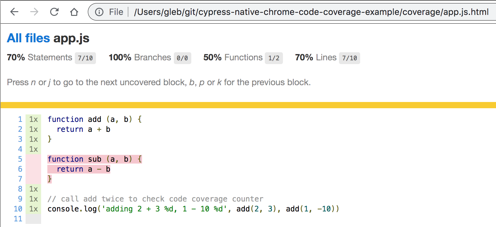

# cypress-native-chrome-code-coverage-example
> Native code coverage in Chrome browser via Debugger protocol during Cypress end-to-end tests

## Main pieces

- Connecting to Chrome via [chrome-remote-interface](https://github.com/cyrus-and/chrome-remote-interface) copied from [flotwig/cypress-log-to-output](https://github.com/flotwig/cypress-log-to-output).
- Code coverage via [Debugger Protocol](https://chromedevtools.github.io/devtools-protocol/tot/Profiler/) copied from [https://github.com/cyrus-and/chrome-remote-interface/issues/170](https://github.com/cyrus-and/chrome-remote-interface/issues/170). See [cypress/plugins/index.js](cypress/plugins/index.js)
- Conversion of v8 coverage to Istanbul-compatible coverage using [v8-to-istanbul](https://github.com/istanbuljs/v8-to-istanbul)

```shell
npm run cy:open
npm run report
```

The output is saved to `coverage/index.html`



## More info

- [A quick look at how Chrome's JavaScript code coverage feature works](https://www.mattzeunert.com/2017/03/29/how-does-chrome-code-coverage-work.html)
- Istanbul [coverage format](https://github.com/gotwarlost/istanbul/blob/master/coverage.json.md)
